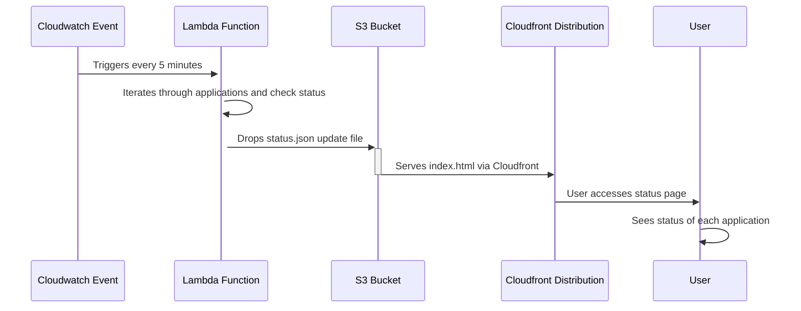

# trade-tariff-lambdas-status-checks

Scheduled go lambda function to check the P90 status of the various services and store the results in an status.json file in s3 for review on a static status page



Individual application checks are configured per environment using a configuration type struct
that is loaded from one of:

- config/applications.development.toml
- config/applications.staging.toml
- config/applications.production.toml

An example configured application for `config/applications.development.toml`

```toml
[[application]]
name = "Trade Tariff FPO Search"
url = "https://search.dev.trade-tariff.service.gov.uk/fpo-code-search"
authHeader = "X-Api-Key"
authHeaderValue = "env:API_KEY"
verb = "POST"
data = '{"description":"cheesecake"}'
errorHighWatermarkPercentage = 50.0
errorMediumWatermarkPercentage = 20.0
errorLowWatermarkPercentage = 1.0
p90HighWatermarkSeconds = 10.0
p90MediumWatermarkSeconds = 3.0
p90LowWatermarkSeconds = 1.0
concurrency = 3
```

The meaning of these configuration items is as follows:

| Field Name                         | Description |
|------------------------------------|-------------|
| `Name`                             | The name of the application configuration (seen in the status page). |
| `url`                              | The URL associated with the application, used for network requests. |
| `authHeader` (optional)            | The key/name of the authorization header to use in network requests (e.g. X-Api-Key or Authorization). |
| `authHeaderValue` (optional)       | The value to be used for the authorization header in network requests. (e.g. `env:API_KEY`). These are injected at deploy time  |
| `verb` (defaults to "GET")         | The HTTP method (verb) to be used in network requests, such as `GET`, `POST`, etc. |
| `data` (optional)                  | The data to be sent in the body of network requests, if applicable. |
| `errorHighWatermarkPercentage`     | The high watermark percentage for error rates beyond which an application is considered to be in a `INACTIVE` state. |
| `errorMediumWatermarkPercentage`   | The medium watermark percentage for error rates that indicate a `DEGRADED` but acceptable state. |
| `errorLowWatermarkPercentage`      | The low watermark percentage for error rates considered `ACTIVE` under normal operation. |
| `p90HighWatermarkSeconds`          | The high watermark for 90th percentile response times, above which performance is considered `INACTIVE`. |
| `p90MediumWatermarkSeconds`        | The medium watermark for 90th percentile response times, indicating caution but not necessarily `DEGRADED` state. |
| `p90LowWatermarkSeconds`           | The low watermark for 90th percentile response times, considered `ACTIVE` under normal conditions. |
| `concurrency`                      | How many workers to execute concurrently for this application. |
