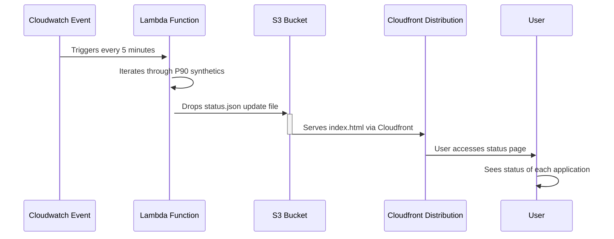

# trade-tariff-lambdas-status-checks

Scheduled go lambda function to check the P90 status of the various services and store the results in an status.json file in s3 for review on a static status page

